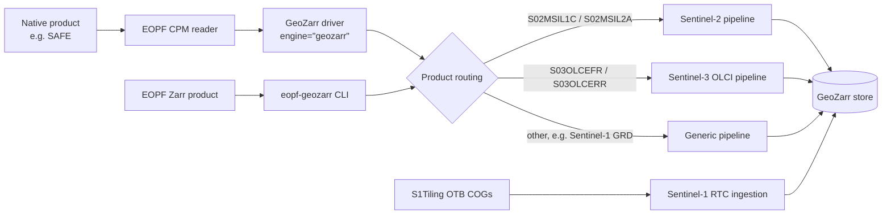
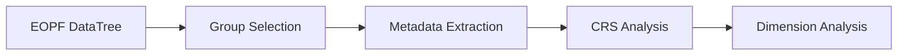
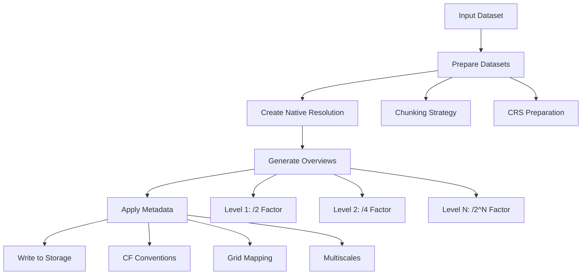

# Architecture

eopf-geozarr has two entry points, the GeoZarr driver for EOPF CPM and the
standalone `eopf-geozarr` CLI. Both select one of three conversion pipelines
and write a GeoZarr store that follows the [GeoZarr mini spec](geozarr-minispec.md).

## Design principles

- **Native projections**: the source CRS is kept; nothing is reprojected to
  Web Mercator.
- **Source data kept**: the native resolutions and the source packing are
  kept; only overviews are computed.
- **Cloud-native output**: Zarr v3 with chunking, optional sharding and
  consolidated metadata, on local or S3-compatible storage.
- **Standards**: the GeoZarr conventions (`multiscales`, `geo-proj`,
  `spatial`) and CF metadata for older readers.

## System overview



## Package layout

| Module | Role |
|---|---|
| `cpm/` | GeoZarr driver for EOPF CPM: `writer.py` (`GeoZarrWriter`, engine `geozarr`, `eopf convert-geozarr`) and `routing.py` (product routing, no CPM dependency). |
| `cli.py` | Standalone `eopf-geozarr` command line. |
| `s2_optimization/` | Sentinel-2 pipeline: native levels, overviews, encoding, band injection. |
| `s3_olci_optimization/` | Sentinel-3 OLCI pipeline: swath or regular grid, overviews. |
| `conversion/` | Generic pipeline (`geozarr.py`), Sentinel-1 GRD RTC ingestion (`s1_ingest.py`), Sentinel-1 reprojection, source opening, storage and metadata utilities. |
| `stac/` | STAC item builders (Sentinel-1 GRD RTC). |
| `data_api/` | pydantic-zarr models of the EOPF products and of GeoZarr, and the mini spec validator (`data_api/geozarr/validation.py`). |
| `pyz/` | pydantic-zarr helpers used by the models. |
| `codecs/` | Helpers for the Zarr `scale_offset` codec. |

## Core Components

### 1. Generic pipeline (`conversion/geozarr.py`)

The generic pipeline converts the listed groups:

```python
# test: skip
def create_geozarr_dataset(
    dt_input: xr.DataTree,
    groups: List[str],
    output_path: str,
    **kwargs
) -> xr.DataTree
```

**Key Functions:**

- `setup_datatree_metadata_geozarr_spec_compliant()`: Sets up GeoZarr-compliant metadata
- `write_geozarr_group()`: Writes individual groups with proper structure
- `create_geozarr_compliant_multiscales()`: Creates multiscales metadata

### 2. File System Utilities (`conversion/fs_utils.py`)

Handles storage operations across different backends:

**Local Storage:**

- Path normalization and validation
- Zarr group operations
- Metadata consolidation

**S3 Storage:**

- S3 path parsing and validation
- Credential management
- S3-specific Zarr operations

**Key Functions:**

- `get_storage_options()`: Unified storage configuration
- `validate_s3_access()`: S3 access validation
- `consolidate_metadata()`: Metadata consolidation

### 3. Processing Utilities (`conversion/utils.py`)

Core processing algorithms:

**Chunking:**

```python
# test: skip
def calculate_aligned_chunk_size(
    dimension_size: int,
    target_chunk_size: int
) -> int
```

**Downsampling:**

The library uses xarray's built-in `.coarsen()` method for efficient downsampling operations, providing better integration with lazy evaluation and memory management.

**Sentinel-2 Optimization:**

The S2 optimization module uses a functional programming approach with stateless functions for improved testability and maintainability:

```python
# test: skip
def convert_s2_optimized(
    dt_input: xr.DataTree,
    output_path: str,
    **kwargs
) -> xr.DataTree
```

### 4. Command Line Interface (`cli.py`)

Provides user-friendly command-line access:

- `convert`: Main conversion command
- `validate`: GeoZarr compliance validation
- `info`: Dataset information display

## Data Flow

### 1. Input Processing



1. **DataTree Loading**: Load EOPF dataset using xarray
2. **Group Selection**: Select specific measurement groups to process
3. **Metadata Extraction**: Extract coordinate and variable metadata
4. **CRS Analysis**: Determine native coordinate reference system
5. **Dimension Analysis**: Calculate optimal chunking and overview levels

### 2. Conversion Process



### 3. Output Structure

The library creates a hierarchical structure compliant with GeoZarr specification:

```
output.zarr/
├── .zattrs                    # Root attributes with multiscales
├── measurements/
│   ├── r10m/                  # Resolution group
│   │   ├── .zattrs           # Group attributes
│   │   ├── 0/                # Native resolution
│   │   │   ├── b02/          # Band data
│   │   │   ├── b03/
│   │   │   ├── b04/
│   │   │   ├── b08/
│   │   │   ├── x/            # X coordinates
│   │   │   ├── y/            # Y coordinates
│   │   │   └── spatial_ref/  # CRS information
│   │   ├── 1/                # Overview level 1 (/2)
│   │   └── 2/                # Overview level 2 (/4)
│   ├── r20m/                 # 20m resolution group
│   └── r60m/                 # 60m resolution group
└── .zmetadata                # Consolidated metadata
```

## Metadata Architecture

### 1. CF Conventions Compliance

The library ensures full CF (Climate and Forecast) conventions compliance:

```python
# Coordinate variables
x_attrs = {
    'standard_name': 'projection_x_coordinate',
    'long_name': 'x coordinate of projection',
    'units': 'm',
    '_ARRAY_DIMENSIONS': ['x']
}

y_attrs = {
    'standard_name': 'projection_y_coordinate', 
    'long_name': 'y coordinate of projection',
    'units': 'm',
    '_ARRAY_DIMENSIONS': ['y']
}
```

### 2. Grid Mapping Variables

Each dataset includes proper grid mapping information:

```python
# test: skip
grid_mapping_attrs = {
    'grid_mapping_name': 'transverse_mercator',  # or appropriate mapping
    'projected_crs_name': crs.to_string(),
    'crs_wkt': crs.to_wkt(),
    'spatial_ref': crs.to_wkt(),
    'GeoTransform': transform_string
}
```

### 3. Multiscales Metadata

The converter writes the [multiscales convention](https://github.com/zarr-conventions/multiscales) attributes on the parent group. Each level entry points at a sibling subgroup (`r{2**level}`) carrying the downsampled dataset:

```python
# test: skip
multiscales = {
    "resampling_method": "mean",
    "layout": [
        {
            "asset": "r10m",                     # native, group root
            "transform": {"scale": [1, 1], "translation": [0, 0]},
        },
        {
            "asset": "r20m",                     # overview
            "derived_from": "r10m",
            "transform": {"scale": [2, 2], "translation": [0, 0]},
        },
        {
            "asset": "r40m",
            "derived_from": "r10m",
            "transform": {"scale": [4, 4], "translation": [0, 0]},
        },
    ],
}
```

## Performance Considerations

### 1. Chunking Strategy

The library implements intelligent chunking to optimize performance:

```python
def calculate_aligned_chunk_size(dimension_size: int, target_chunk_size: int) -> int:
    """Calculate chunk size that divides evenly into dimension size."""
    if target_chunk_size >= dimension_size:
        return dimension_size
    
    # Find largest divisor <= target_chunk_size
    for chunk_size in range(target_chunk_size, 0, -1):
        if dimension_size % chunk_size == 0:
            return chunk_size
    return 1
```

**Benefits:**

- Prevents partial chunks that waste storage
- Improves read/write performance
- Reduces memory fragmentation
- Better Dask integration

### 2. Memory Management

**Lazy Loading:**

- Uses xarray's lazy loading capabilities
- Processes data in chunks to manage memory usage
- Supports out-of-core processing for large datasets

**Band-by-Band Processing:**

```python
# test: skip
def write_dataset_band_by_band_with_validation(
    ds: xr.Dataset,
    output_path: str,
    max_retries: int = 3
) -> None
```

### 3. Parallel Processing

**Dask Integration:**

- Supports Dask distributed computing
- Automatic parallelization of chunk operations
- Configurable cluster setup

**Retry Logic:**

- Robust error handling for network operations
- Configurable retry attempts
- Graceful degradation on failures

## Storage Architecture

### 1. Storage Abstraction

The library provides a unified interface for different storage backends:

```python
# test: skip
def get_storage_options(path: str, **kwargs) -> Optional[Dict[str, Any]]:
    """Get storage options based on path type."""
    if is_s3_path(path):
        return get_s3_storage_options(path, **kwargs)
    return None
```

### 2. S3 Integration

**Features:**

- Automatic credential detection
- Custom endpoint support
- Bucket validation
- Optimized multipart uploads

**Configuration:**

```python
# test: skip
s3_options = {
    'key': os.environ.get('AWS_ACCESS_KEY_ID'),
    'secret': os.environ.get('AWS_SECRET_ACCESS_KEY'),
    'endpoint_url': os.environ.get('AWS_ENDPOINT_URL'),
    'region_name': os.environ.get('AWS_DEFAULT_REGION', 'us-east-1')
}
```

### 3. Metadata Consolidation

Zarr metadata consolidation for improved performance:

```python
def consolidate_metadata(output_path: str, **storage_kwargs) -> None:
    """Consolidate Zarr metadata for faster access."""
    store = get_zarr_store(output_path, **storage_kwargs)
    zarr.consolidate_metadata(store)
```

## Error Handling and Validation

### 1. Input Validation

- DataTree structure validation
- Group existence checks
- CRS compatibility verification
- Dimension consistency checks

### 2. Processing Validation

- Chunk alignment verification
- Memory usage monitoring
- Progress tracking
- Intermediate result validation

### 3. Output Validation

- GeoZarr specification compliance
- Metadata completeness checks
- Data integrity verification
- Performance metrics collection

## Extensibility

### 1. EOPF CPM integration

The GeoZarr driver plugs into EOPF CPM through two documented extension points:

- the writer registry (`EOWriterRegistry`), under the engine name `geozarr`
- the `eopf.cli` entry-point group, which adds `eopf convert-geozarr`

A new product type needs a routing rule in `cpm/routing.py` and a pipeline.

### 2. Configuration System

Flexible configuration through:

- Environment variables
- Configuration files
- Runtime parameters
- Default value inheritance

## Testing Architecture

### 1. Unit Tests

- Individual function testing
- Mock external dependencies
- Edge case coverage
- Performance benchmarks

### 2. Integration Tests

- End-to-end conversion workflows
- Storage backend testing
- Real dataset processing
- Cloud environment testing

### 3. Local Test Data

The library uses an efficient testing approach with **lightweight JSON-based Zarr groups** that contain only the structure and metadata (no chunked array data). This provides:

- **Faster Test Execution**: Tests run locally without downloading large datasets
- **No Remote Dependencies**: Eliminates need for network access during testing
- **Lightweight Fixtures**: JSON files define Zarr group structure using `pydantic-zarr`

Test fixtures are created from JSON schemas in `tests/_test_data/` (for example `s2_examples/` for Zarr v2 and `v3_s2_examples/` for Zarr v3 Sentinel-2 products). Golden snapshots of the converted output live in `tests/_test_data/optimized_geozarr_examples/`; regenerate them with `REGENERATE_SNAPSHOTS=1 pytest -k snapshot`.

### 4. Validation Tests

- GeoZarr specification compliance
- Metadata accuracy verification
- Data integrity checks
- Performance regression testing
